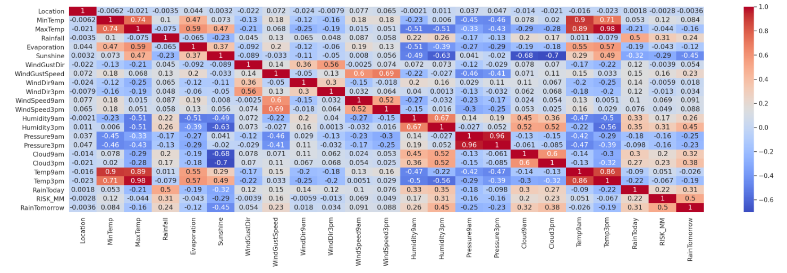
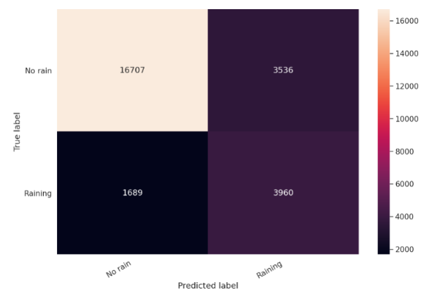

# Rain-prediction

The purpose of this project is to predict if it will rain tomorrow. The data includes weather information (i.e., temperature, evaporation, wind speed, humidity, pressure and cloud status) of different locations in Australia. The data is quite imbalanced having a few instances of rain information. The objective is to train a neural network to predict rain tomorrow from the given information.

• Pytorch is used for training.  
• Feature selection is performed using Pearson's correlation.  
• SMOTE is used to over sample minority class.  
• A neural network is trained with 3 hidden layers and 2 dropout layers.  
• Overall 80% accuracy is achieved. (F1=0.73)

# Performance:

# How to run:
Please check rainPrediction.ipynb file.
